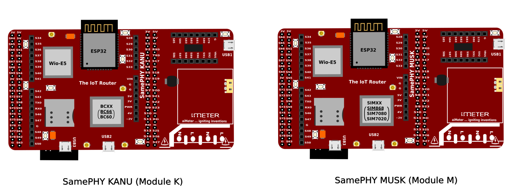

Flavours of SamePHY
===================

Currently, SamePHY comes in two flavour modules:

- SamePHY MUSK (also called "Module M")
- SamePHY KANU (also called "Module K")

Both flavors are compatible with the Arduino and Raspberry Pi form factors and they only differ in the type of GSM/GPRS modem on-board - that is, where **Module M** uses **SIMXXX** (a modem series from SIMCOM manufacturers), **Module K** uses **BCXX/MCXX** (a modem series from QUECTEL manufacturers).

**SamePHY MUSK**

Features of SamePHY MUSK

- WiFi & BT/BLE
- LoRa/LoRaWAN
- SigFox & wM-Bus
- Zigbee/Thread
- BT, GSM/GPRS & GNSS (SIM868E)
- NBIoT/LTE Cat M1 (SIM7020/SIM7080)
- Matter Bridge
- Arduino Form Factor Compatible
- Raspberry Pi Form Factor Compatible

**SamePHY KANU**

Features of SamePHY KANU 

- WiFi & BT/BLE
- LoRa/LoRaWAN
- SigFox & wM-Bus
- Zigbee/Thread
- BT, GSM/GPRS (MC60)
- NBIoT/LTE Cat M1 (BC66)
- Matter Bridge
- Arduino Form Factor Compatible
- Raspberry Pi Form Factor Compatible
