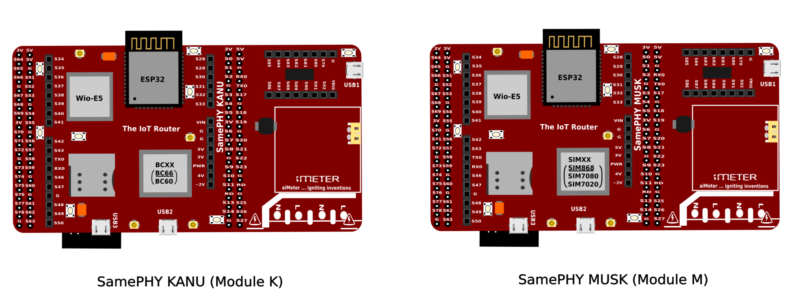

Getting Started
===================================

SamePHY is a highly reconfigurable development board, a gateway of all sorts of radios, an Arduino shield, a HAT for two Raspberry Pi and a host for its “Jobs link here”. Being the gateway of all radio communications currently available is the basis for the name (SamePHY) meaning "Same PHYsical" Layer, as it is the last layer/bridge for all radio communications currently available, be it **THREAD, ZIGBEE, BLUETOOTH(BT/BLE), WIFI, LoRa/LoRaWAN, SigFox & wM-Bus, GSM/GPRS NBIoT/LTE Cat M1 (BC66) ...** The board houses up to 7 CPUs and 2 Ultra Low Power Processors all ranging from instruction sets such as ARM, Intel, RISC-V & Xtensa ISAs with a Board Dimension of 51 x 100mm which is lesser than the size of an Arduino Mega Board

Flavours of SamePHY 
-------------------
Currently, SamePHY comes in two flavour modules:

- SamePHY MUSK (also called "Module M")
- SamePHY KANU (also called "Module K")

Both flavors are compatible with the Arduino and Raspberry Pi form factors and they only differ in the type of GSM/GPRS modem on-board - that is, where **Module M** uses **SIMXXX** (a modem series from SIMCOM manufacturers), **Module K** uses **BCXX/MCXX** (a modem series from QUECTEL manufacturers).

SamePHY MUSK
~~~~~~~~~~~~
Features of SamePHY MUSK

- WiFi & BT/BLE
- LoRa/LoRaWAN
- SigFox & wM-Bus
- Zigbee/Thread
- BT, GSM/GPRS & GNSS (SIM868E)
- NBIoT/LTE Cat M1 (SIM7020/SIM7080)
- Matter Bridge
- Arduino Form Factor Compatible
- Raspberry Pi Form Factor Compatible

SamePHY KANU
~~~~~~~~~~~~
Features of SamePHY KANU 

- WiFi & BT/BLE
- LoRa/LoRaWAN
- SigFox & wM-Bus
- Zigbee/Thread
- BT, GSM/GPRS (MC60)
- NBIoT/LTE Cat M1 (BC66)
- Matter Bridge
- Arduino Form Factor Compatible
- Raspberry Pi Form Factor Compatible

